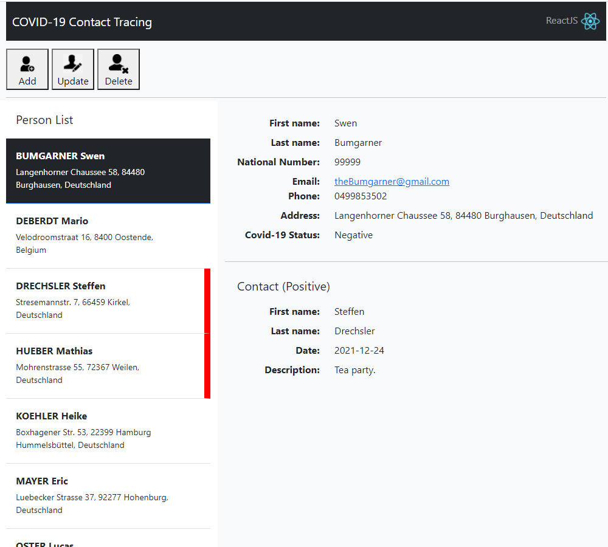

# contact-tracing

A React application I developed as a project for my university course on Web Development. It demonstrates using React to develop a Covid-19 contact-tracing application. The React application calls a webservice that was developed using NodeJs. The webservice reads its data from a MySQL database.

A working system can be obtained by downloading just the file: docker-nginx-nodejs-mysql.zip

1. Unzip "docker-nginx-nodejs-mysql.zip"
2. Open a command prompt and navigate to the folder where you unziped (1)
3. run "docker-compose build"
4. run "docker-compose up -d"
5. Take your browser to "http://localhost/index.html"

The Wiki contains a collection of videos that show the application in action.

